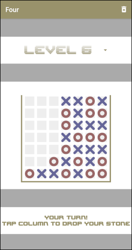

# Four In A Row

This is an implementation of a game engine in Java. The user interaction happens in the most simple way via system console.

## How to run it

You can simply load the project in your favourite Java IDE and hit the "Execute" button.

## Stand-alone Version

You can create a stand-alone version in the form of a jar file. I provided a script `build.sh` that will create a jar file, assuming the .class files have been created by the IntelliJ IDEA IDE. Your mileage might vary. A ready-made jar file is included in the git repository. You can execute it like this:

	java -jar four.jar

## Debugging the Stand-alone Version

One purpose of this project is to gain a better understanding of the underlying minimax search. Even at low game settings the hierarchical search tree gets quite big in terns of number of positions. A linear trace log would be very long and impossible to read for a human reader. Therefore a solution was needed to browse the search tree in a hierarchical way. This is now done by creating the trace log as an XML structure.

You create the XML trace log by starting the game with the command line option `debug`, for instance:

	java -jar four.jar debug

The game will create a log file named `debug001.xml` or similar. You can then load the file into an XML editor of your choice, and click yourself deeper into the search tree in places you want to understand better.

One good choice of an XML editor is [XML mind](https://www.xmlmind.com/xmleditor/).

Note: the debug file will be created in the current working directory.

## Mobile App

Playing the console version is already fun and has a certain old-school flair.

However, playing on a mobile device is even more fun, with a better user experience and the ability to play anywhere anytime.

We have added a simple Android app to this repository. You find the source code in the subdirectory `android`. You can simply add this directory as a new project in Android Studio, or whichever development environment you prefer. This way you can install it on your device or an emulator, modify the source code, debug it, etc.

For those just wanting to play we provide the ready-built [APK file](android/app/release/app-release.apk). Simply copy it to your device and "open" it to install it.

We are currently in the process of bringing the app into Google Play as well, to make installation even easier.

The mobile app has a [data privacy statement](android/DataProtection.md).

### Localisation

We are open to including more languages into the app. Please send us a pull request, or a translated [strings.xml](android/app/src/main/res/values/strings.xml) file.
